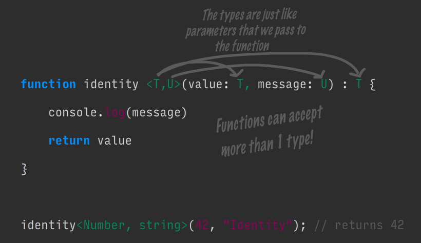
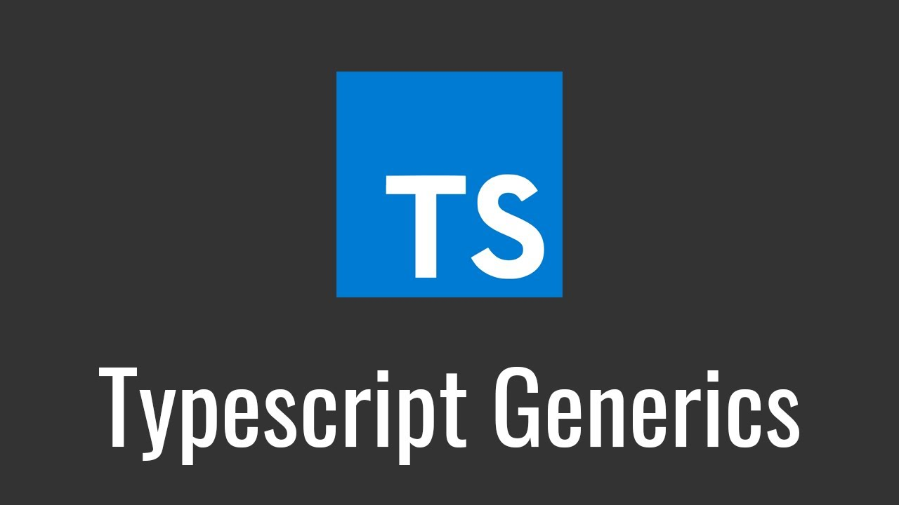
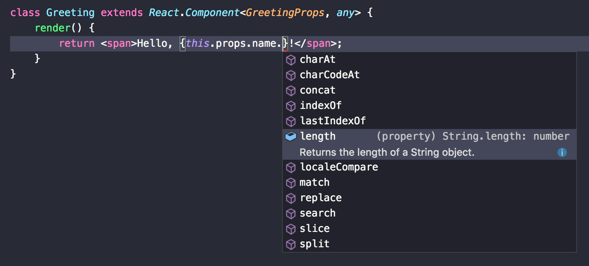

# Статья с картинками

Команда тайпскрипта определила свой проект как язык, являющийся надмножеством над javascript для декларации типов наших объектов, сущностей. Так оно и есть, но я посчитал его большим.

Тайпскрипт, обладая структурной строгой типизацией дал огромный плюс, сохранил гибкость javascript и в то же время позволил вносить достаточные ограничения, какие считают необходимыми команда разработчиков.
А обладая возможностью реализации вычислимых функций в самой системе типов представляет огромный потенциал.

Однако, последняя возможность может ввести в заблуждение, как меня. Являясь разработчиком я, как и полагается, решил автоматизировать описание своих типов. Программировать типы.
Это был неверный шаг.

В структурной типизации самое главное сохранить структуру типа при его вычислении. Это накладывает неразрешимые ограничения, одно из которых - совместимость типов массива и типа объединения.
В тоже время это предполагает легкость преобразования типов без потери их вычисления, что крайне важно для вывода.
И  это действительно так, если нет преобразований с массивами и вложенными массивами. Здесь вы умрете.

Казалось бы, в 3.4 завезли context type. И да, он работает. И все хорошо. Если не одно но. Тот случай, когда ты не можешь на него полагаться, создавая библиотеку типов или сильный рантайм чек.
Тебе придется в любом случае написать собственный тип объединения, который растянется на тысячи строк наитупейшего кода.
Придется описать всю собственную систему типов. От примитивов до объектов с кучей типов-вспомогателей для преобразований.
Тут же откроется и вся магия с condition, mapped и infer типами. Шутка про дженерики больше не будет казаться смешной. У тебя они везде и всюду.
Будут настолько сложными и связанными, что некоторые не смогут прочитать.

Ты полагаешься только на себя. Нет никаких практик по работе с этим языком, за исключением возможности использования номинативной типизации.
Но уже ты принял вызов.

Описав кучу типов, огромное их количество, ты все еще далек до идеала. Тебе необходимо как-то работать с типами массивов и объектов, или других структур.
Та задача, которой ты больше всего опасаешься. Здесь все решит твоя глупость и упертость. Буду обыкновенным бараном начинаешь программировать типы базовые-методов массива и объектов.
Тип объединения и твои теперь любимые дженерики сильно помогут. Ты сделаешь эти типы.

Но счастье не придет. Ты столкнешься с проблемой производительности. На пк разработчиков некоторые редакторы и ide просто виснут, не выводят типы или начинают лагать. Это создает массу неудобст и вся твоя работа тут же теряет свою ценность.
Может ты где то ошибся в написание своих типов и/или можно все поправить?
Давай-ка проверим. Откроем первый файл с "прикладными" типами. Осмотримся. И закроем. Все твои типы - хрусталь.

Как ты проверял эти типы? Писал тип "Check", который дергал другой тип с разными параметрами? Прямо как ты дебажил свой js в 2000-х.
Ты не можешь гарантировать верность их работы. Нет никаких тестов. Ничего. Ты практически беспомощен. У тебя тысячи строк этих типов. Они связаны между собой. Обвязаны какими-то костылями. Любое изменение может затронуть массу других типов.
Кажется, мы это уже давно проходили.

Ты снова смотришь на свои типы и у тебя закрадывается сомнение. Для чего ты описал "низкоуровневые" типы-методы массивов и объектов?
Команда самого typescript делает это.

Что-то здесь не так, ты неверно понял философию языка. Ушел в дебри. Проделал уйму сложной работы.
Еще в замешательстве ты идешь к доке языка и видишь главное для себя слово: "Надмножество".